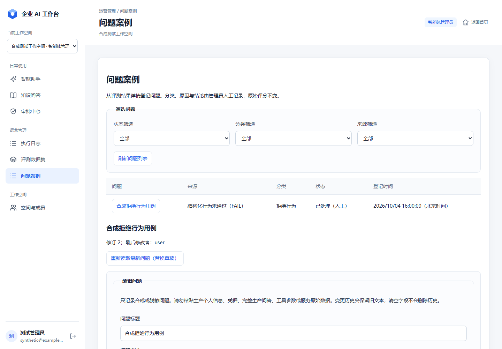
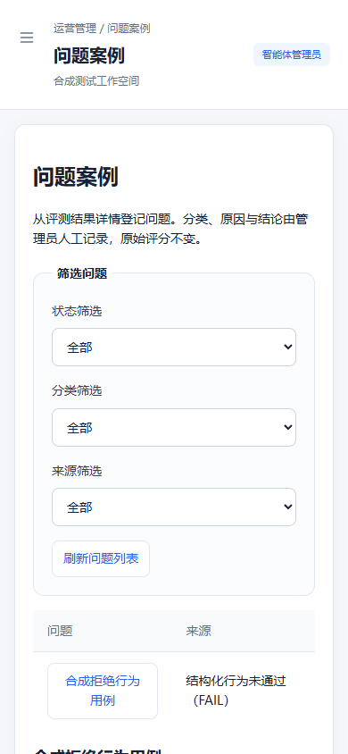

# Feature 018 - Implementation and Verification

日期：2026-10-04。状态：实施与必需验证完成，待人工合并 PR #43。
基线：`main` / `origin/main` `78ec01394b49d0f8b0ae508472500154d8e646db`。
批准：用户在本聊天以“实施”批准 proposal commit `c4f85bc` 的 H1–H4，随后要求“继续”。
Issue：[42](https://github.com/SongHaiwen-creator/enterprise-ai-workbench/issues/42)。
PR：[43](https://github.com/SongHaiwen-creator/enterprise-ai-workbench/pull/43)。

## 实施范围

- Additive migration `0013`：仅两张新表，历史 migrations `0001`–`0012` 未改。
- 五个 API：来源登记、Workspace 列表、详情、PATCH 与只读人工历史。
- 原始终态来源引用、FAIL/ERROR/PASS 人工复核区分、单一源结果防重复。
- 状态/结论规则、row lock + expected_revision 防覆盖、原子 append-only 变更历史。
- 保密文本限合成/脱敏数据；strict 请求与安全报错；当前权限复核与 composite FK。
- 中文运营导航、评测详情登记入口、过滤/分页/编辑/结束/重开、字面证据与历史展示。
- 冲突/模糊提交先核查；Workspace/session 变化与迟到响应隔离；显式刷新替换草稿。

没有新增依赖、运行数据库迁移、Provider 请求、Tool adapter、Approval/Mock 业务写入、
执行日志正文、新角色或权限政策、源 Run 改写、版本比较或后续 Feature。

## 验证结果

| 检查 | 本次结果 |
|---|---|
| Feature 018 单元与 PostgreSQL 专项 | 82 passed；无 skips |
| 受影响的历史迁移回归 | 55 passed；无 skips |
| 完整 backend pytest | 1602 passed；无 skips；74 个既有类别 deprecation warnings |
| Ruff `check backend` | passed |
| 新前端及评测运行专项首轮修正后 | 21 passed；随后新增同 revision 显式刷新回归，纳入全量 |
| 完整 frontend `pnpm test` | 9 API + 110 UI passed；无 skips |
| `pnpm lint` | passed |
| `pnpm build` | passed；包含 `/`、`/app` |
| 浏览器 QA | 桌面 1440×1000、移动 390×844；合成响应；登记/结束/重开、员工入口限制、退出清空、字面证据、无页面错误/页面横向溢出 |
| Migration | `0012 -> 0013`、downgrade/re-upgrade、唯一 head、metadata parity、旧表结构/旧迁移字节、FK/check/unique/SQL NULL 负例 passed |
| 真实独立 Sessions | 并发登记、revision 竞争、5 秒锁超时、撤权前提交/保密读复核 passed |
| 自审与独立复审 | 无剩余阻塞；同 revision 草稿刷新 P2 已修复并回归覆盖 |
| `git diff --check` | passed |

PostgreSQL 验证仅使用经过现有安全检查的 `enterprise_ai_workbench_test`，和
`DATABASE_URL` 中运行库不同；测试串行进行。测试 fixture 重置的是专用测试库 public
schema，并未连接或迁移运行/生产数据库。测试使用 fake providers；018 本身无 provider 路径。

完整后端命令在工作树 `backend` 目录运行，设置 `PYTHONPATH` 指向该目录，使用现有项目
Python venv。最终命令为：

```text
python -m pytest tests -q -x -p no:cacheprovider --basetemp=../.cache/feature018-complete-pytest
```

前端依赖从既有 `pnpm-lock.yaml` 安装，未修改依赖清单或 lockfile。
QA 使用本地 headless Chrome 与全部拦截的合成 API 响应，不能替代真实后端集成测试；
授权、隔离、状态与事务断言另由真实 PostgreSQL HTTP/独立 Session 测试覆盖。

## 发现与修正

- nullable 文本约束最初对 null 应用长度校验；调整为 string 分支限长、外层处理空白/null。
- 非法 UTF-8 解析由 Starlette HTTPException 抛出；新路由捕获并返回固定 422，旧路由不变。
- 独立复审发现：相同 id/revision 重新读取不会替换编辑器本地草稿。
  成功读取时增加 editor epoch；含同 revision 网络失败情景的回归测试。
- 历史版本迁移测试最初把新表纳入旧 metadata，并有旧 head 断言；改为各历史版本
  对应 metadata 与当前 head，未降低历史结构/约束验证。
- 系统 pytest 临时目录拒绝访问；改用工作树独立 `.cache`，先创建父目录并单独验证
  原基准测试，再跑完整 suite。最终无 skips；早期失败不计作通过证据。
- 自动审批服务曾因额度限制不能完成测试调用审查，该调用未执行；用户要求继续后
  重试成功。后续测试与 Git 操作按正常审批机制执行。
- 移动端表格过度压缩列；为表格设置最小宽度并只在表格区域滚动，统一次要按钮样式。

## 截图

所有内容为合成示例，不是生产数据。





## 保留限制与交付边界

人工根因/结论不代表系统认证；无自动复测或关闭。人工历史保留旧明文，不能通过编辑
清空达到删除效果；无 DLP/purge/DBA 防篡改保证。最终授权读取后仍有既有短暂撤权竞争窗口。
规划 PR #40 仍未合并；本功能与其 018 范围一致，不引入未批准后续能力。
Issue #42 仅在 PR #43 人工合并后关闭；本线程停在 Feature 018 PR-ready。
仓库 head `0013` 不能推断运行数据库 revision，运行/生产升级仍须单独授权。
